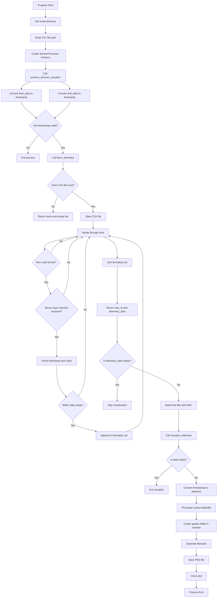

# HealthChecker Prototype

This repository contains a prototype Python application designed to fetch, process,
and visualize telemetry data from multiple sensors.

## Features
- Token-based API interaction (mocked)
- Date to timestamp conversion
- Multiple device (MAC-based) telemetry handling
- Modular and class-based design

## Project Structure

## 🔁 Process Flow

